# Insights & Alerts Lightning Web Component

Disclaimer: This is a demo component for demo purposes only. The base of the code is generated using Agentforce Vibes that I started to build on, code quality may vary!

Custom Lightning Web Component that reads and displays custom insight objects from the Salesforce org. Gives a compact yet expandable view of each insight and allows filtering based on the context.

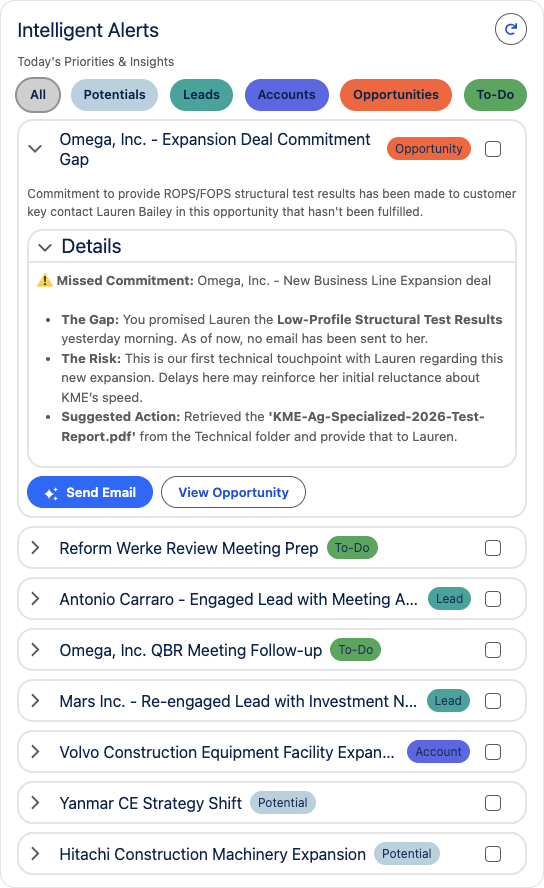

Note: All of the data in the picture is mockup data and not based on anything real.

# Table of Contents

- [VS Code for Salesforce DX Setup](#vs-code-for-salesforce-dx-setup)
- [Deployment](#deployment)
- [Deploy with Agentforce Vibes](#deploy-with-agentforce-vibes)
- [Manual Deployment](#manual-deployment)
- [View the Insights and Alerts Component](#view-the-insights-and-alerts-component)
- [Creating Insights and Alerts](#creating-insights-and-alerts)

## VS Code for Salesforce DX Setup

[Resources for installing VSCode for Salesforce DX projects](https://developer.salesforce.com/docs/platform/sfvscode-extensions/overview)

# Deployment

To deploy to your org, you will first need to:

1. ### Clone the Repository to Your Local Machine

    Use git to clone the repository or download it and open it in Visual Studio Code.

2. ### Connect Your Organization

    Press `Command + Shift + P` on Mac or `Control + Shift + P` on Windows to bring up the Command Palette. Search for the command `SFDX: Authorize an Org` and run it.

3. ### Enable Einstein Generative AI and Agentforce

    The custom object inside the project uses Agentforce's quick actions, so Agentforce needs to be enabled for deployment.

    Open your organization's Setup menu, search and click `Agentforce & Gen AI`

    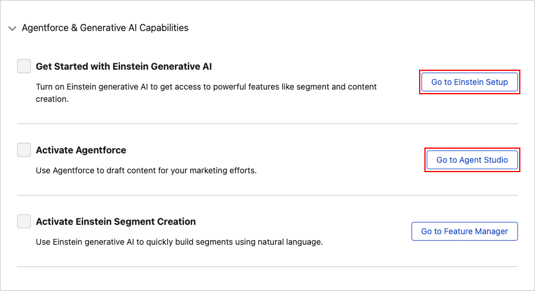

    Click `Go to Einstein Setup` and enable `Turn on Einstein`

    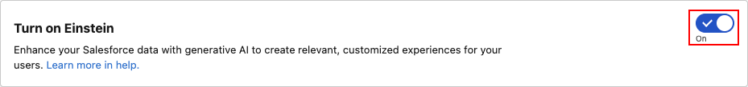

    Navigate back to `Agentforce & Gen AI` and click `Go to Agent Studio`

    Enable Agentforce from the top right toggle on the `Agentforce Agents` section

    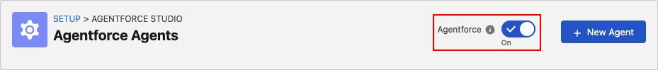

## Deploy with Agentforce Vibes

This deployment method uses Agentforce Vibes' Workflow functionality. Make sure you have authorized your org.

To deploy with the included workflow:

1. Open Agentforce Vibes chat window and write the command

    ```sh
    /deploy_component.md
    ```

    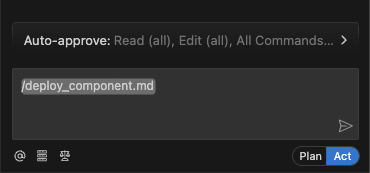

2. After a successful deployment, you can view the component by following [View the Insights and Alerts Component](#view-the-insights-and-alerts-component)

### Troubleshooting

If Agentforce Vibes ran into issues or you can not see the component after running the workflow, you can try again with a new chat by pressing the `+` Sign at the top of the Agentforce Vibes chat window.

Starting a new task will make sure that any previous chats will not interfere with the workflow process.

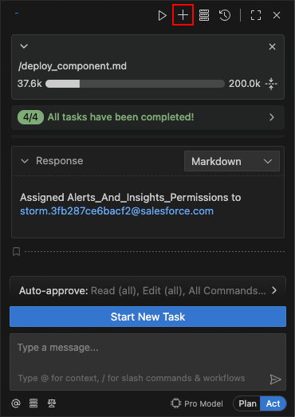

Follow the [Manual Deployment](#manual-deployment) steps if the deployment with Agentforce Vibes does not work.

## Manual Deployment

If deployment with Agentforce Vibes did not work, or you wish to manually deploy the project, follow these steps.

Make sure you have followed the first steps of [Deployment](#deployment) to connect your organization and enable Einstein Gen AI and Agentforce.

1. ### Deploy the Metadata

    Right-click the `force-app` folder and select `SFDX: Deploy This Source to Org` to deploy the needed metadata to your connected organization.

    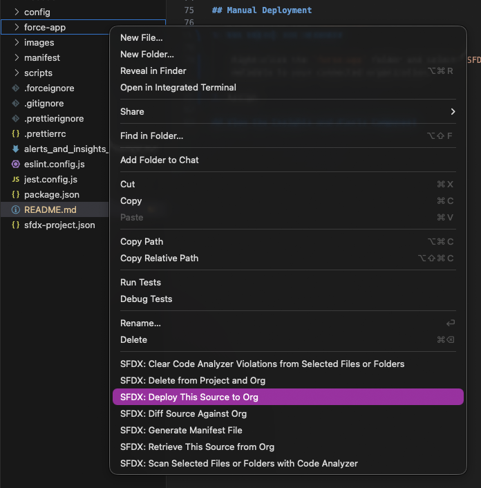

2. ### Assign the Permission Set to View the Component

    The deployed metadata includes a permission set with permissions to view the component. You will need to assign anyone who wants to view the component to the permission set.

    Open your organization's Setup menu, search and click `Permission Sets`

    Search and click the permission set `Alerts And Insights Permissions`

    Click `Manage Assignments`

    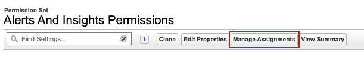

    Click `Add Assignment` and select yourself and any other users you want to access the component.

    You should see yourself in the Current Assignments list once you're done.

    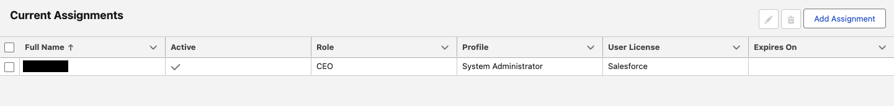

## View the Insights and Alerts Component

Once you have deployed the component either with Vibes or manually, you should be able to see the included Insights and Alerts application inside your organization.

Refresh your browser window by pressing `Command + R` on Mac or `Control + R` on Windows.

Open the App Launcher from the top left and search for `Insights And Alerts`

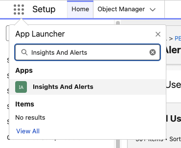

Click the Insights And Alerts application to see the demo page with 3 different setups of the component.

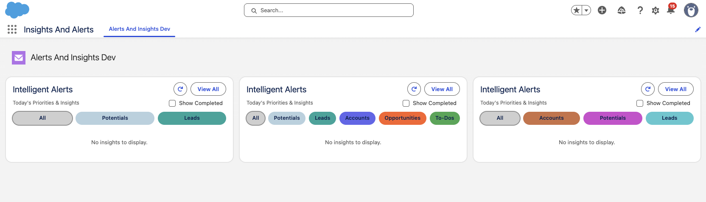

Note that the component is empty since there are no Insight and Alert records created yet.

## Creating Insights and Alerts

To create records that will be shown inside the component, search for `Insight and Alerts` in the App Launcher's Items section.

Please be aware of the inconsistent naming between the object, permission set and app.

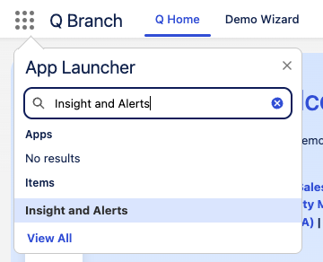

Create a new Insight and Alert record by pressing the `New` from the top right corner.

Specify the details and context of the insight.

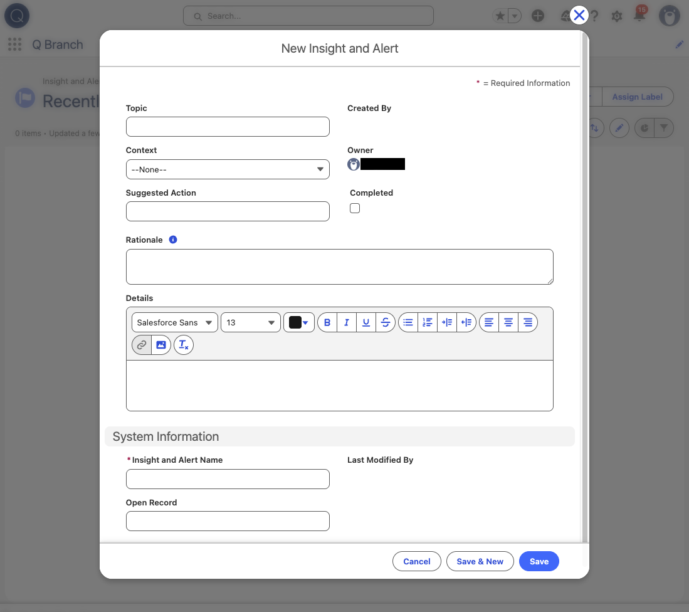

## Context Filtering Guide

The `Insights and Alerts Window` Lightning Web Component takes in an input string that defines the scope of insights to show inside it.

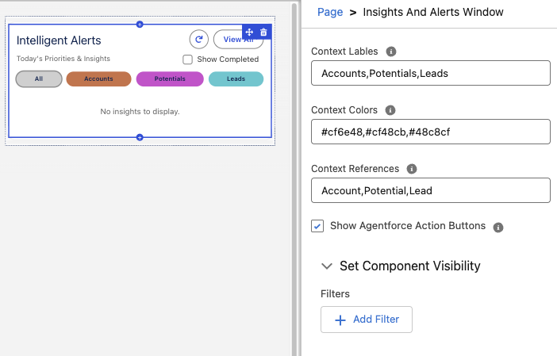

The example inputs on the image above results in the 3 filter buttons being created:

| Context Label | Context Color | Context Reference |
| --- | --- | --- |
| Accounts | #cf6e48 | Account |
| Potentials | #cf48cb | Potential |
| Leads | #48c8cf | Lead |

Note how the first values of each text input gets grouped into a single filter button, the second values into another button etc.

### Inputs Explained

As shown on the image, the component takes in 4 inputs. The text inputs take comma separated values to define the aspects of each filter button.

**NOTE:** If the number of values do not match between the 3 text inputs, filter buttons are only created for the sets that have all the values defined.

| Input Name | Description |
| --- | --- |
| Context Labels | Label of each context filter button shown. |
| Context Colors | Hexadecimal color of each filter button. |
| Context References | The context type that each filter button will show. These values are **CASE SENSITIVE** and will define what types of insights will be shown in the component. The `All` button will show the insights of all the given types. |
| Show Agentforce Action Buttons | Enables the suggested action dummy buttons for the expanded details views of each insight. |